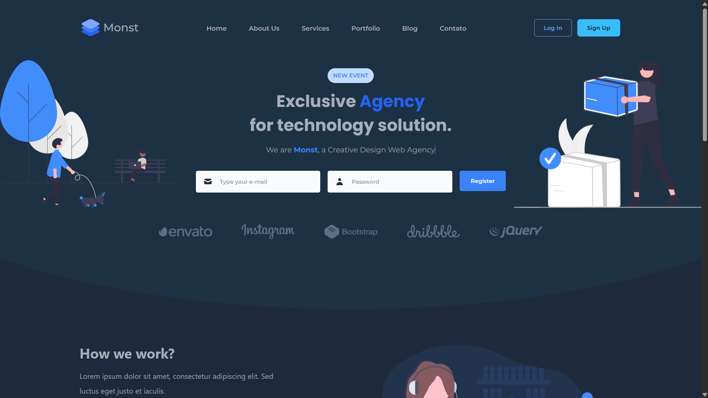

# Monst

> Status : Unfinished project 🕰️ / Open PR

## Tamplate clone

> Look the design: https://wp.alithemes.com/html/monst/index-5.html

_Technologies_

- SvelteKit 
- TailwindCSS 
- DaisyUI 
- TypeScript 

### How to use

- git clone https://github.com/12Gustavo21/Monst.git or download the zip
- code . (if you use VSCode)
- start a Live Server

## 💻 Online Page: None Yet

## 🌐 Contact me:

 
